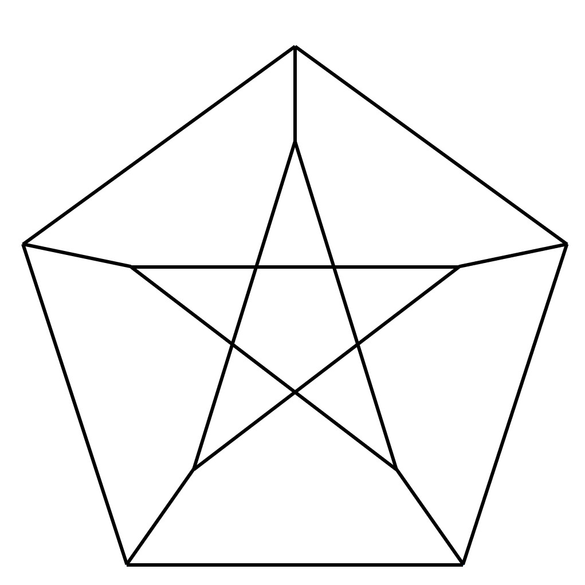

# 第二章 道路与回路

## 2.1 道路与回路概述

### 2.1.1 路径

+ 无向图 $G$

  + 无向图 $G$ 的一个有限点边交替序列 $P=\lbrace v_0,e_1,v_1,e_2,v_2,...,e_m,v_m  \rbrace$ 

    若对 $\forall i \in \lbrack 1,m \rbrack \land N,e_i$ 的端点是 $v_{i-1}$ 和 $v_i$ , 则称 $P$ 是图 $G$ 的一条**路径** 

    + $v_0$ 称为 $P$ 的**起点**

    + $v_m$ 称为 $P$ 的**终点**

    + $m$ 称为 $P$ 的**长度**  

  + 边均不相同的路径称为**链**

  + 结点均不相同(**起点和终点允许相同**)的路径称为**道路**/**路**

  + 起点和终点相同的路径称为**闭路径**

  + 起点和终点相同的链称为**闭链**

  + 起点和终点相同的道路称为**回路**

+ 有向图 $D$ 

  + 有向图 $D$ 的一个有限点边交替序列 $P=\lbrace v_0,e_1,v_1,e_2,v_2,...,e_m,v_m  \rbrace$

    若对 $\forall i \in \lbrack 1,m \rbrack \land N,e_i=(v_{i-1},v_i)$ , 则称 $P$ 是图 $D$ 的一条**有向路径** 

  + **起点**,**终点**,**长度**

  + **有向链**, **有向道路**, **有向闭链**, **有向回路**, **有向闭路径**

+ **弦**

  + 设 $C$ 是无向简单图 $G$ 中含顶点数大于 $3$ 的一个回路, 如果结点 $v_i$ 和 $v_j$ 在 $G$ 中不相邻$,$

    但$(v_i,v_j) \in E(G)$, 则称 $(v_i,v_j)$ 是 $C$ 的一条**弦**

+ **最长道路** $P$ : 长度最长

+ **极长道路** $P$ : 不存在其他道路以 $P$ 为其中一段

+ 问题解决

  + 起始状态(结点), 目标状态(结点), 动作(边)

  + 三个量筒 $(3,5,8)$ 分别装了 $(0,0,8)$ 的水, 怎么得到两个 $4$ 的水

    + 寻找一条从 $(0,0,8)$ 到 $(0,4,4)$ 的有向路径

---

+ $给定无向图G,若 \delta(G) \geq 2,则G必包含回路$

+ 非简单图显然, 简单图**极大路径法**(**极大性原则**/**极小性原则**)

---

---

+ $若 \delta(G) \geq 3, 则G中必含带弦回路$
+ **极大路径法**

---

### 2.1.2 连通(考虑简单图)

+ 在无向图 $G$ 中, 若两结点 $u,v$ 之间存在路径, 则称 $u,v$ 是**连通**的, 记作 $u \sim v$

  + 是一种 **等价关系**

  + 规定 $u \sim u$

+ 若图中任意两个顶点都是连通的, 就称 $G$ 是**连通图**$,$

  否则则称 $G$ 是**非连通图**/**分离图**

+ 若 $u,v$ 之间存在路径, 必存在路(**极小路径法**)

+ 连通关系 $"\sim"$ 是 $V(G)$ 上的等价关系$,$

  设**商集** $\frac{V(G)}{\sim}=\lbrace V_1,...,V_k \rbrace$ $,$

  则导出子图 $G[V_i],(1 \leq i \leq k)$ 为 $G$ 的**极大连通子图**, 称为 $G$ 的**连通分支**$,$

  $k$ 称为 $G$ 的**连通分支数**, 记作 $\kappa(G)$

+ $\kappa(G)=1 \Leftrightarrow $ $G$ 是连通图$,$ 

  $\kappa(G) > 1 \Leftrightarrow  $ $G$ 是非连通图, $G$ 可以表示成 $\kappa(G)$ 个连通分支的并 $\Leftrightarrow$ $G=\bigcup\limits_{i=1}^kG[V_i]$ 

---

+ $设图G是无向简单图,\kappa(G)=k,则有 n-k \leq m \leq \frac12(n-k)(n-k-1) $

+ $k=1 \Leftrightarrow n-1 \leq m \leq \frac12n(n-1) $

  + 只需证明 $n-1 \leq m$

  + **归纳法**

+ $k > 1,连通分支的和$

  + $a(a+1)+b(b+1) \leq (a+b)(a+b+1), \forall a,b \geq 0$

---

+ **树** : $G是连通图,|E(G)|=|V(G)|-1$

### 2.1.3 距离

+ 无向图 $G$ 中

  + 若结点 $u,v$ 是连通的, 则称$u,v$之间长度最短的路径为 $u,v$ 之间的**短程线**(**测地线**)$,$

    短程线的长度称为 $u$ 到 $v$ 的距离, 记作 $d(u,v)$

  + 若结点 $u,v$ 是不连通的, $d(u,v)= +\infty$ 

  + $d(u,v) \geq 0,当且仅当u=v时等号成立$

  + $d(u,v)=d(v,u)$

  + $d(u,v)+d(v,w) \geq d(u,w)$

+ 有向图 $D$ 中

  + $d(u,v) = d(v,u)$ 不一定成立

+ **直径** : $d(G)=max \lbrace d(u,v):u,v \in V(G) \rbrace$

### 2.1.4 r部图/二部图

+ 若无向图 $G$ 的结点集 $V$ 存在一个 $r(r \geq 2)$划分$(V_1,...,V_r)$$,$

  使得 $G$ 中每一条边的两个端点都分别属于不同的 $V_i$ $,$

  则称 $G$ 是 **$r$ 部图**, 记作 $G=(V_1,...,V_r:E)$ 

+ **完全 $r$ 部图**

  $G$ 是 $r$ 部简单图, 且 $\forall i,j \in \lbrace (i \in N) \land (j \in N) \land(1 \leq i < j \leq r) \rbrace$,$V_i$中所有结点与$V_j$中所有结点都相邻$,$

  则称 $G$ 是**完全 $r$ 部图**, 记作 $G=K_{n_1,...,n_r}$, 其中 $n_i=|V_i|$

---

+ $无向图G是二部图 \Leftrightarrow G中不包含奇回路$

+ $\Leftarrow:$

  + 非连通图, 考虑其连通分支

  + 连通图, 取定一点 $v_0$

    + 二部 : $V_1 = \lbrace v \in V(G):d(v_0,v)$ $is$ $even \rbrace $

      ​           $V_2 = \lbrace v \in V(G):d(v_0,v)$ $is$ $odd \rbrace$

+ $ \Rightarrow:$

  + 证明 $V_1$ 内的任意两点不相邻

  + $V_2$ 同理

---

+ $任何一个奇闭路径都有一个奇回路$

+ **最短奇闭路径**, 断言其为奇回路

---

### 2.1.5 有向图的连通问题

+ 有向图 $D$, $u,v \in V(D)$

  + **可达关系**

  + $u \rightarrow v:$ $u$ **可达** $v$, 存在一条从 $u$ 到 $v$ 的有向路径

  + 约定 $u \rightarrow u$

+ **强连通图**/**双向连通图** : $D$ 中任意两点互相可达

  + 是等价关系

+ **单连通图** : $D$ 中任意两点 $u,v,u \rightarrow v$ 或者 $v \rightarrow u$ 

+ **弱连通图** : $D$ 的基图是连通图

+ 强连通 $\Rightarrow$ 单连通 $\Rightarrow$弱连通

+ **强连通分支**

  + 有向图的所有边不一定都在某一强连通分支中

  + $D \ne \bigcup\limits_{i=1}^kG \lbrack V_i \rbrack$

+ 有向图的一个**核** $S$

  + $S \subseteq V(G)$

  + $S$ 是独立集, 且 $S$ 外的点在 $S$ 中都有一个直接后继

  + 直接前驱

---

+ $单连通图 D(V,E)中的所有点可以排成一个序列 \lbrace n_1',n_2',...,n_n' \rbrace, 满足n_1' \rightarrow n_2' \rightarrow ... \rightarrow n_n'$

+ 取定一点 $v_0$ , 令$V_2 = \lbrace v:(v_0 \rightarrow v) \land(v \in V) \rbrace$

+ $V_1 =V-V_2-v_0$

+ 对 $V_1$ 归纳

---

+ $设D是有向图$

  + $D是强连通图 \Leftrightarrow 存在一条闭路径包含D的所有顶点$

  + $D是单连通图 \Leftrightarrow 存在一条路径包含D的所有顶点$

---

---

+ $有向图 D 是连通图,D是二部图 \Leftrightarrow D无奇回路$

---

---

+ $不含奇回路的有向图D必有核$

+ $case\ 1:D$ 是强连通图

  + 取定 $D$ 中一个结点 $x$ , 设 $S$ 是到 $x$ 距离为偶数的结点子集

    则每一个到 $x$ 距离为奇数的点都在 $S$ 中有一个直接后继

  + 反证法说明 $S$ 是独立集

    任取 $S$ 中两点 $u,v$, 若$(u,v) \in E(G) \Rightarrow$ 存在奇闭路径 $\Rightarrow$ 存在奇回路

+ $case\ 2:$ $D$ 是一般有向图

  + $D$ 中必有一强连通分支 $D_1$ ,使得 $D_1$ 没有外邻点(**反圈**)

  + $D_1$ 存在核 $S_1$

  + 设 $D'$ 是 $D$ 中删去 $S_1$ 中的点及其所有直接前驱得到的有向图( $D_1$ 都被删去)

  + 对 $D'$ 使用归纳推理, $D'$ 存在核 $S'$

  + $S_1 \cup S'$ 是 $D$ 的核

---

### 2.1.6 反圈

+ **反圈** : **有向无环图**$(DAG)$

  + 将有向图的每一个强连通分支收缩成一个点形成的图是**反圈**

  + 反圈存在**拓扑排序**

+ 拓扑排序

  + $D$ 是反圈, $|V(D)|=n$, 则存在一个从 $V(D)$ 到 $\lbrace i:(i \in N) \land (\ 1 \leq i \leq n) \rbrace$ 的**双射 **$T$

    能够满足 $(u,v) \in E(D) \Rightarrow T(u) < T(v) $

  + 数学归纳法

    + 依次找入度为0的点

      + 有限性, 一定存在一条极长道路 $P:\lbrace v_0,...,v_l \rbrace$

      + $d^-(v_0)=0,d^+(v_l)=1$

    + 依次找出度为0的点(**反序**)

+ [拓扑排序算法](../../Algorithm/topological-sort.cpp)

### 2.1.7 道路存在判定, 连通性判定

#### 2.1.7.1 代数法

+ **邻接矩阵** $A(a_{i,j})_{n \times n}$

+ **路径矩阵** $P(p_{i,j})_{n \times n}$

  + $p_{i,j}=1,\ if(v_i \rightarrow v_j)$

    $p_{i,j}=0,\ else$

  + 约定 $p_{i,i}=1$ $\Leftrightarrow$ 存在 $v_i$ 到 $v_i$ 的闭路径

+ 邻接矩阵,路径矩阵中的元素视作**布尔元**

  + $a,b \in \lbrace 0,1 \rbrace$

  + $a \lor b,a \land b \in \lbrace 0,1 \rbrace$

  + 布尔和 : $a\lor b=0 \Leftrightarrow a=b=0$

  + 布尔积 : $a \land b =1 \Leftrightarrow a=b=1$

  + $\land ,\lor$ 满足交换律, 结合律, 分配律($\times 2$)

---

+ $P=A \lor A^2 \lor ... \lor A^n=\bigvee_{s=1}^nA^s$ 

+ 暴力算法时间复杂度 $O(n^4)$

---

---

+ $Warshall\ 算法$

+ 跳点

+ 算法

  + $Begin:$

  + $1.\ P \leftarrow  A /* 初始化 */$

  + $2.\ for\ k = 1\ to\ n\ do /* 外循环 */$

  + $3.\quad   for\ i = 1\ to\ n\ do /* 内循环 */$

  + $       \ \qquad for\ j = 1\ to\ n\ do$

  + $       	\quad \qquad P_{i,j} \leftarrow  P_{i,j} \lor (P_{i,k} \land P_{k,j})$

  + $End$

+ 时间复杂度 $O(n^3)$

#### 2.1.7.2 搜索法

+ $DFS$

+ $BFS$

+ 一般用**邻接表**存图

## 2.2 最短道路

### 2.2.0 概念

+ 赋权图 $G(V,E,w)$ 的最优化问题之一 : 任意两节点之间的最短路径问题
+ $H \subseteq G,w(H)=\sum\limits_{e \in E(H)} w(e)$
+ $w(e)= + \infty,e \notin E$

### 2.2.1 Dijkstra 算法

+ 不存在负权边, 单源最短路
+ 数组 $l$ 表示距离
  + $l(v)$  中存放着 $u_0$ 到结点 $v$ 的距离
+ 数组 $Q$ 表示最短路径
  + $Q(v)$ 存放 $u_0$ 到节点 $v$ 的最短路径上 $v$ 的直接前驱

---

+ $Dijkstra\ Algorithm$

  + $Step\ 1(initial)$

    + $l(u_0)=0,Q(u_0)=u_0,sum=1,\overline S = V- \lbrace u_0 \rbrace）$

    + $l(\overline u) = w(u_0,\overline u),Q(\overline u) = u_0,\forall \overline u \in \overline S$

  + $Step\ 2$

    + $u' = \arg \min\limits_{u\in \overline S} l(u)$

    + $S=S-\lbrace u' \rbrace,sum=sum+1$

    + $if\ sum=n,end$

      $else\ jump\ to\ Step\ 3$

  + $Step\ 3$

    + $for\ each\ \overline u \in \overline S \cap N^+(u)$

      $\quad if(l(u)+w(u,\overline u)<l(\overline u))$

      $\qquad l(\overline u)=l(u)+w(u,\overline u),Q(\overline u)=u$

+ 时间复杂度 : $O(n^2)+O(m)$

---

### 2.2.2 Ford 算法

+ 存在负权边, 但是不存在负权回路, 单源最短路

### 2.2.3 Warshall-Folyd 算法

+ $D=(d_{i,j})_{n \times n}$
  +  $d_{i,j}$ 表示 $i$ 到 $j$ 的距离
+ $P=(p_{i,j})_{n \times n}$
  + $p_{i,j}$ 表示 $i$ 到 $j$ 最短路径上的直接前驱

---

+ $Warshall-Floyd\ Algorithm$

  + $Step\ 1(initial)$

    + $d_{i,j}=w(i,j),\quad (i,j) \in E(G)$

      $d_{i,j}=0,\qquad \qquad i=j$

      $d_{i,j}=+\infty,\qquad (i,j) \notin E(G)$

    + $k=0$

    + $p_{i,j}=i$

  + $Step\ 2$

    + $for\ i=1\ to\ n$

      $ \quad for\ j=1\ to\ n$

      $\qquad if(d_{i,k}+d_{k,j}<d_{i,j})$

      $\qquad \quad d_{i,j}=d_{i,k}+d_{k,j},\ p_{i,j}=p_{k,j}$

  + $Step\ 3$

    + $if(k=n)\ End$

      $else\ jump\ to\ Step\ 2$ 

+ 时间复杂度 : $O(n^3)$

---

## 2.3 欧拉图

### 2.3.1 基本概念与定理

+ 无向连通图 $G$ 中有一条包含 $G$ 中所有边的**闭链**, 则称此闭链为**欧拉闭链**/**欧拉链**, 称 $G$ 为**欧拉图**
+ 无向连通图 $G$ 中有一条包含 $G$ 中所有边的**开链**, 则称此开链为**欧拉开链**, 称 $G$ 为**半欧拉图**
+ 欧拉图一定不是半欧拉图, 半欧拉图一定不是欧拉图

---

+ 无向连通图 $G$

  + $G$ 是欧拉图 $\Leftrightarrow$ $G$ 中所有结点都是偶节点
    + $\Leftarrow$
      + 对结点数进行归纳
      + 极化原理, 最长闭链, 断言其为欧拉链

  + $G$ 是半欧拉图 $\Leftrightarrow$ $G$ 中恰有两个奇节点

---

+ **有向欧拉图**

---

+ $D$ 是弱连通图
  + $D$ 是有向欧拉图 $\Leftrightarrow$ $d^+(v)=d^-(v),\forall v \in V(G)$

---

---

+ 无向连通图 $G$ 有 $k$ 个奇结点, 则 $E(G)$ 可划分为 $\frac{k}2$ 条开链

---

### 2.3.2 应用(编码)

+ **笛波滤恩序列**/**笛波滤恩图**

  + 存在一个由 $2^n$ 个二进制数组成的循环序列, 使得 $2^n$ 个由 $n$ 个连续的二进制数组成的输出全不相同
  + 这样的序列称为**笛波滤恩($DeBruijn$)序列**
  + 对应的有向欧拉图称为**笛波滤恩图**, 记作 $G_{2,n}$
  + 结点为 $n-1$ 长的序列 $a_1a_2...a_{n-1}$, 共 $2^{n-1}$个
  + 有向边表示一个输出
    + 从结点 $a_1a_2...a_{n-1}$ 到 $b_1b_2...b_{n-1}$
    + 满足 $a_i=b_{i-1},\ \forall i \in [2,n-1] \land N$
    + 表示的边为 $a_1a_2...a_{n-1}b_1$

+ 更一般的**笛波滤恩序列**/**笛波滤恩图**

  + $\Sigma = \lbrace 0,1,...,\sigma-1 \rbrace$ 是字母表, $\Sigma$ 上长度为 $n$ 的不同字共有 ${\sigma}^n$ 个
  
    存在一个$\Sigma$ 上的循环序列 $a_0a_1...a_L(L={\sigma}^n)$
  
    对于每一个长度为 $n$ 的字 $w$, 存在**唯一**的 $i(0 \leq i \leq L-1)$ 
  
    使得 $w=a_ia_{i+1}...a_{i+n-1}$(溢出取模,循环序列)
  
  + 这样的序列称为**笛波滤恩($DeBruijn$)序列**
  
  + 对应的有向欧拉图称为**笛波滤恩图**, 记作 $G_{\sigma,n}$
  
  + 结点为 $n-1$ 长的序列 $a_1a_2...a_{n-1}$, 共 ${\sigma}^{n-1}$ 个
  
  + 有向边表示一个输出
    + 从结点 $a_1a_2...a_{n-1}$ 到 $b_1b_2...b_{n-1}$
    + 满足 $a_i=b_{i-1},\ \forall i \in [2,n-1] \land N$
    + 表示的边为 $a_1a_2...a_{n-1}b_1$
  
+ 两只蚂蚁比赛问题

## 2.4 哈密顿图(H图)

### 2.4.1 基本概念与定理

+ 无向图 $G$ 

  + 存在一条过全部顶点的回路, 这条回路称为**哈密顿回路**/**$H$ 回路** 

    包含哈密顿回路的图称为**哈密顿图**/**$H$ 图**

  + 存在一条过全部顶点的道路(**强调起点终点不相同**), 这条道路称为**哈密顿道路**

    包含哈密顿道路的图称为**半哈密顿图**/**半 $H$ 图**

+ 哈密顿图是连通图, 半哈密顿图是连通图
+ 自环重边不影响一个图是否为哈密顿图

+ 完全图 $K_n$ 是哈密顿图
+ 迄今还未有判断 $H$ 图的准则

---

+ $无向图G是H图 \Rightarrow 对于V(G)的每一个非空真子集X,均有\kappa (G-X) \leq |X|$
  + $设C是G的一个H回路,\kappa(G-X) \leq \kappa(C-X),只需证明 \kappa(C-X) \leq |X|$
  + $对|X|归纳$
+ $非充要条件$
  + $Petersen图(彼得森图)不是H图$

---

---

+ 
定理2.4.1:

+ $对于无向简单图G的任意一条极长道路P= \lbrace v_1v_2...v_l \rbrace(l \geq 3)$

  $若d(v_1)+d(v_l)\geq l,则G中存在回路C, 使得V(C) \subseteq V(P) $
---

---

+ $如果简单图G的任意两个不同结点u,v都满足:d(u)+d(v) \geq n-1 \Rightarrow G是半H图$
+ $反证法证明G连通$
+ $取最长道路P= \lbrace a_1a_2...a_l \rbrace$
  + [定理2.4.1](#theory1)$断言l=n$

---

+ $例题:$

  + $n(n \geq 3)个人, 任何两个人合在一起都认识其余(n-2)个人$

    $证明这n个人可以排成一队,使得相邻者都相互认识$

+ $证明:$
  + $任意一个人v最多不认识一个人,否则假设u_1,u_2为v不认识的两人,则u_1,u_2合在一起不认识v,矛盾$
  + $\Rightarrow \delta(G) \geq n-2$
  + $d(u)+d(v) \geq 2(n-2) \geq n-1$

---

+ $如果简单图G的任意两个不同结点u,v都满足:d(u)+d(v) \geq n \Rightarrow G是H图$
+ $推论:简单图G,\delta(G) \geq \frac{n}2 \Rightarrow G是H图$

---

---

+ $G是无向简单图,u,v是两个不相邻的顶点,且满足d(u)+d(v)\geq n,则$

  $G是H图 \Leftrightarrow G+(u,v) 是H图$

+ $\Rightarrow:$ 显然
+ $\Leftarrow:$
  + $H$ 路不经过 $(u,v)$ $\Rightarrow OK$
  + $H$ 路经过 $(u,v)$ 
    + 在图 $G$ 中应用[定理2.4.1](#theory1)

---

+ **闭合图**

+ 无向简单图 $G$, 令$G_0=G,G_1=G_0+(u_0,v_0),G_2=G_1+(u_1,v_1),...,G_{i+1}=G_i+(u_i+v_i)$ 

  其中, $u_i,v_i$ 是 $G_i$ 中不相邻的顶点, 且满足 $d_{G_i}(u_i)+d_{G_i}(v_i) \geq n$, 
  
  直至存在 $k(0 \leq k \leq \frac{n(n-1)}2)$ 使得 $G_k$ 中不存在两个不相邻的结点 $u,v$ 满足 $d_{G_k}(u)+d_{G_k}(v) \geq n$
  
  $G_k$ 称为 $G$ 的**闭合图**, 记作 $C(G)$

---

+ $闭合图唯一$

---

---

+ $无向简单图 G$
  + $G是H图 \Leftrightarrow C(G) 是H图$

---

---

+ $(2k+1)阶k正则图G是H图$

+ $证明(闭合图):$

  + $\forall u,v \in V(G),d(u)=d(v)=k,d(u)+d(v)=2k$

  + $取一点v_0,记N(v_0)=V,V(G)-V-\lbrace v_0 \rbrace = V',|V|=|V'|=k$

  + $V中必然有两点不相邻,否则V+ \lbrace v_0 \rbrace =K_{n+1},此时V'中最大结点度小于(k-1),矛盾$

  + $取V中不相邻的两点u,v,在G'=G- \lbrace v_0 \rbrace考虑作闭合图,以下叙述基于图G',为了证明G'是H图$

    + $n=2k,\mathop{d(w)}\limits_{w \in V'} =k,\mathop{d(w)}\limits_{w \in V}=k-1$

    + $\mathop{d(w)}\limits_{w \in V'} =k,作闭合图V'中不相邻的点全相连,G \rightarrow K_k,此时$

      + $\mathop{d(w)}\limits_{w \in V'} \geq k$
      + $\mathop{d(w)}\limits_{w \in V}=k-1$

    + $加边(u,v),此时$

      + $d(u)=d(v)=k$
      + $\mathop{d(w)}\limits_{w \in V'} \geq k+1,\qquad (u,v,V')$
      + $\mathop{d(w)}\limits_{w \in V-\lbrace u,v \rbrace}=k-1$

    + $作闭合图,加边\lbrace (u,w):w \in V' \rbrace,\lbrace (v,w):w \in V' \rbrace,此时$

      + $d(u),d(v)\geq k+1, \qquad (u/v,V')$
      + $\mathop{d(w)}\limits_{w \in V'}\geq k+1$
      + $\mathop{d(w)}\limits_{w \in V-\lbrace u,v \rbrace}=k-1$

    + $V+V',此时$

      + $\mathop{d(w)}\limits_{w \in V-\lbrace u,v \rbrace} \geq k,\qquad (V')$

        $\Rightarrow \delta(G') \geq k \Rightarrow G'是H图$

  + $G’含H回路C$

    + $C包含(u,v)$
      + $C-(u,v)+(v_0,u)+(v_0,v)是G的H回路 \Rightarrow OK$
    + $C不包含(u,v)$
      + $若存在v_0的两个邻点v_x,v_y在C中相邻$
        + $C-(v_x,v_y)+(v_0,v_x)+(v_0,v_y)是G的H回路 \Rightarrow OK$
      + $此时回路C中一定是一个点属于V一个点属于V'交替排列$
        + $在C中,将v_0与一非邻点交换,重复以上7行操作$
        + $若还找不到G的H回路,再寻找一个没有尝试过的v_0的非邻点进行交换,直至找到G的H回路$
        + $一定能找到G的H回路,否则v_0,V'的邻点相同,此时\mathop{d(v)}\limits_{v \in V} = k+1\ne k, 矛盾$

## 2.5 作业

+ $1.1\ 无向图G和\overline G至少有一个是连通图$

+ $1.2\ D为有向图,若d^+(D) \geq 1 \Rightarrow D 中含有有向回路$

+ $1.3\ 设G是n(n \geq 2)阶无向图, 则存在G的支撑二部子图H满足\ d_H(v) \geq \frac12d_G(v), \forall v \in V(G)$

+ $1.4\ 无向简单图G,n \geq 4,m \geq 2n-3 \Rightarrow G中含有带弦回路$

+ $1.5\ 无向连通图任意两条最长道路必有公共结点$

+ $1.6\ G不含三角形的无向简单图,求证:$

  + $a. \sum_{i=1}^nd^2(v_i) \leq mn$

  + $b.m \leq \frac{n^2}4$

+ $1.7\ 完全图K_n(n \geq 3)所有边都赋以整数权,证明:$

  + $K_n的每个回路的权都是偶数 \Leftrightarrow K_n的所有奇数权边诱导出一个空图或者支撑完全二部图$

## 2.6 参考答案

+ $1.1\ 分类讨论$

  + $case\ 1:G连通$

  + $case\ 2: G非连通$

    + $G可划分为k=\kappa (G) 个连通分支G_1,G_2,...,G_k$

    + $任取v_1 \in G_1,v_2 \in G_2$

    + $在 \overline G 中,v_1与v_2相邻,v_1与G_i(i \ne 1)中的点都相邻, v_2与G_1中的点都相邻$

    + $ \overline G 连通 $

+ $1.2\ 极大路径法$

+ $1.3\ 边数最多的极大支撑二部子图$

  + $设H是G边数最多的极大支撑二部子图,H的顶点划分为\lbrace V_1,V_2 \rbrace$

  + $设v是G的任一顶点, 不妨设v \in V_1$

    + $则有d_H(v) \geq \frac12d_G(v)$

      $否则,取\lbrace V_1-v,V_2+v \rbrace 为新的划分,得到一个新的支撑二部子图H'$

       $此时 |E(H')| > |E(H)|, 与假设矛盾$

+ $1.4\ 数学归纳法$

  + $case\ 1: n=4,m \geq 5,\Rightarrow \delta(G) \geq 5*2/4 \Rightarrow \delta(G) \geq 3 \Rightarrow OK$

  + $case\ 2: n \geq 5$

    + $case\ 2.1:\delta(G) \geq 3 \Rightarrow OK$

    + $case\ 2.2:\delta(G) \leq 2$

      + $对G-v归纳$

      + $对于G-v, n \geq 4, m \geq 2k-3-2=2(k-1)-3$

+ $1.5\ 反证+最长道路$

+ $1.6\ $

  + $a.$

    + $对于任意的边e(u,v),d(u)+d(v) \leq n$

      $对所有边求和 \Rightarrow OK$

  + $b.$

    + $取G中度最大的点v_0,d(v_0)=k$

    + $N(v_0)中的点互不相邻$

    + $V(G)-N(v_0)中的点度小于k$

    + $握手定理:\sum_{i=1}^nd(v_i) = 2m$

    + $k+k(n-k-1)+(n-k-1+1)k \geq 2m \Rightarrow m \leq k(n-k) \leq \frac{n^2}4$

+ $1.7\ 分类讨论+反证法$

  + $ \Leftarrow:显然$

  + $\Rightarrow:设奇数边权诱导的图为J$

  + $case\ 1:不含奇数权边 \Rightarrow J= \emptyset$

  + $case\ 2:含奇数边权$

    + $断言J是二部图,否则存在奇回路,奇回路边权之和为奇数(J所有边权都是奇数)$

    + $J=( V_1,V_2:E )$

    + $断言J是完全二部图,否则\exists u_1,u_2 \in V_1,v_1,v_2 \in V_2 ,s.t. (u_1,v_1) \in J,(u_2,v_2) \notin J$

    $此时回路 \lbrace u_1,v_1,v_2,u_1.u_2 \rbrace 的权值之和为奇数$

    + $断言|V(J)|=n,否则\exists w \in K_n-J,u \in V_1,v \in V_2,回路 \lbrace w,u,v,w \rbrace权值之和为奇数$

