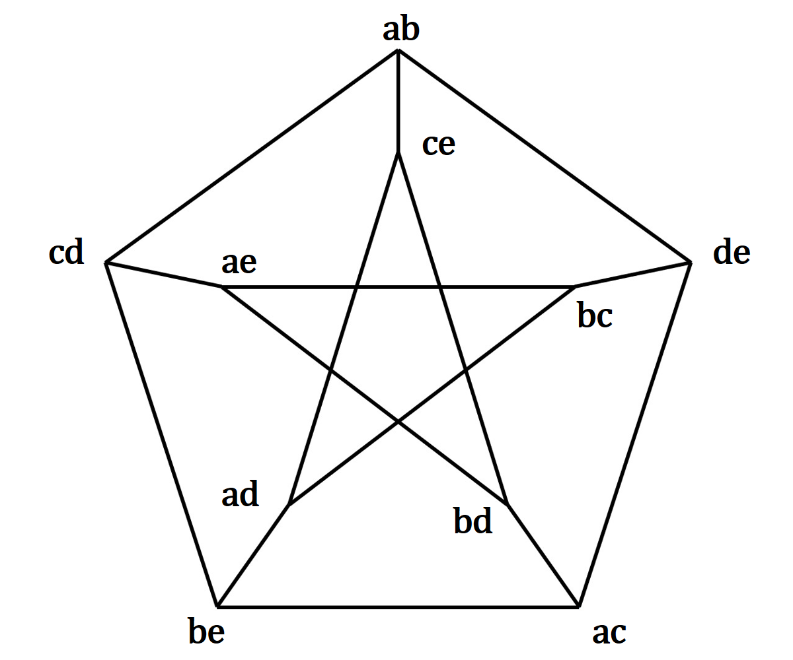

# 第四章 平面图与图的着色

## 4.1 平面图

+ 实际应用
  + 单面印刷电路板的设计
  + 大规模集成电路的布线
  + 交通, 通讯, 城市建筑等
+ **可平面图**与**平面图**
  + 若能把图 $G$ 画在一个平面上, 使得任何两条边都不相交, 则称 $G$ **可嵌入平面**, 称 $G$ 为**可平面图**
  + **可平面图**在平面上的的一个**嵌入**(**画法**)称为**平面图**
+ 举例 
  + $K_4$ 是**可平面图**, $(b)(c)$为 $K_4$ 的两个平面嵌入, $(b)(c)$为**平面图** 

```C
只有o是结点,其他的都是边
                                                                           
                                                                           
                       +----------------+                                  
                       |                |                    o             
     o-------o         o-------o        |                   /|\            
     |\     /|         |      /|        |                  / | \           
     | \   / |         |     / |        |                 /  o  \          
     |  \ /  |         |    /  |        |                /  / \  \         
     |   X   |         |   /   |        |               / /     \ \        
     |  / \  |         |  /    |        |              //         \\       
     | /   \ |         | /     |        |             o-------------o      
     |/     \|         |/      |        |                                  
     o-------o         o-------o        |                                  
                       |                |                                  
                       +----------------+                                  
                                                                           
        K4                    (b)                            (c)           
```

+ 设 $G$ 是一个平面图, 由它的若干条边所围成的区域内若不含其他任何边, 就称该区域为 $G$ 的一个**面**/**域**,

  称满足以上条件的边数最少的**闭路径**为该域的**边界**

+ 在平面上, 我们平面图 $G$ 外面的无限区域称为**无限域**, 其他区域称为**内部域**

+ 如果两个域的边界交集不为空, 则称他们是**相邻**的, 否则则是**不相邻**的

+ **开集** : **开集**中的任何两点都可以用一条折线连起来,使得这条折线与平面图的任意结点/边都不交

+ 举例 : 

  + 图 $G$ 域 $x$ 的边界为 $a-b-d-e-a-f-a$
  + 图 $G$ 无限域的边界为 $a-b-c-b-d-e-a$

```C
                                    a---------b------c      
                                    |\        |             
                                    | \   x   |             
                                    |  f      |             
                                    |         |             
                                    e---------d             
                                                            
                                        g                   
```

---

+ $割边一定是一个域的边界, 非割边是一定是某两个域的的公共边界$

---

---

+ $Jordan\ 曲线定理$
+ $一个平面上的一条封闭的连续曲线C将平面分成两个区域,两区域中各取一点, 连接两点的任何曲线一定与C相交$

---

---

+ $K_{3,3},K_5是典型的不可平面图,本质上仅有这两种图不可平面$

---

---

+ $G是可平面的 \Leftrightarrow G是可球面的$

+ $G的平面图的无限域对应G球面图的一个有限域$

+ $旋转使北极点处于某一面内, 从这一点向球面各边界上的点作直线, 交于南极点的切面,$

  $切面上形成的图案将切面划分为不同的面, 切面上的面与球面上的面构成双射$

---

+ **轮胎面**与**球面**拓扑性质不同

---

+ $平面图基本定理:欧拉定理$

+ $若G是平面连通图,则G域的数目d=m-n+2$

  + $生成树加弦$
    + $d=1+(m-(n-1))=m-n+2$

+ $推论1:若\kappa(G)=k,则d=m-n+k+1$

  + $无限域重合$
  + $d = \sum\limits_{i=1}^kd_i -k+1 = \sum\limits_{i=1}^k((m_i-n_i+2)) - k+1= m-n+2k-k+=m-n+k+1$ 

+ $推论2:对于任意平面图G,n-m+d \geq 2$

  + $k=n-m+d-1 \geq 1$

+ $推论3:图G是阶不小于3的简单平面图 \Rightarrow m \leq 3n-6$

  + $case\ 1:G含回路$

    + $无自环重边 \Rightarrow G的回路边数大于等于 3\Rightarrow 平面图G的任何域的边界数大于等于3$

      $\Rightarrow \frac{3d}2 \leq m$

    + $d=m-n+k+1 \geq m-n+2$

    + $\frac23m \geq d \geq m-n+2 \Rightarrow m \leq 3n-6$

  + $case\ 2:G不含回路$ 

    + $m \leq n-1 \leq 3n-6$

  + $证毕$

---

+ $平面连通图G没有割边,且每个域的边界数都是t \Rightarrow m=\frac{t(n-2)}{t-2}$
  + $m=\frac{dt}2$
  + $d=m-n+k+1=m-n+2$
+ $若G是平面简单图, 则 \delta(G) \leq 5$
  + $若 \delta(G) \geq 6,由握手定理m \geq \frac{6n}2 = 3n > 3n - 6,矛盾$ 
+ $若平面图G的每个域的边界上的边数目都大于等于4,则 \leq 2n - 4$
  + $\frac{4d}2 \leq m, d \geq m -n + 2$
  + $\Rightarrow m \leq 2n - 4$
+ $两个典型的非平面图:K_{3,3}(边数最少的非平面图),K_5(结点数最少的非平面图)$
  + $K_{3,3}$
    + $m=9,n=6,K_{3,3}所有域的边界数大于等于4$
    + $若K_{3,3}为平面图,应该满足m \leq 2n - 4,而实际上不满足,矛盾$
  + $K_5$
    + $m=10,n=5$
    + $m > 3n - 6,矛盾$ 
  + $K_5又称K^{(1)}图,K_{3,3}又称K^{(2)}图$
+ **同胚图**
  + $如果对图G进行若干如下操作得到图G', 则称图G与图G'同胚$
    + $a.\ 在图G的某条边中间插入一个结点, 该结点将该边变成两条边$
    + $b.\ 在图G的某个结点度为2的结点关联的两条边(非自环)并成一条边$
  + $G是可平面图 \Leftrightarrow G的任意同胚图是可平面图$
+ $K^{(1)}$ 和 $K^{(2)}$ 的所有同胚图分别称为 **$K^{(1)}$ 型图**和 **$K^{(2)}$ 型图**, 统称 **$K$ 型图**

---

+ $Kuratowski,1930$
+ $G是可平面图 \Leftrightarrow G没有K型子图$

---

+ 图平面性检测算法 $DMP$
+ **对偶图**
  + 设 $G$ 是平面图, 如下方法构造的图 $G^{\ast}$ 称为 $G$ 的**对偶图**
    + $1.\ G中每个域f_i设置一点v^{\ast}_i作为G^{\ast}的结点$
    + $2.\ 对G的非割边e_k, 它必是G中某两个域f_i,f_j的的公共边界, 则画一条G^{\ast}的边e_k^{\ast}=(v_i^{\ast},v_j^{\ast})与e_k相交一次$
    + $3.\ 对G的割边e_k, 它必是某域f_i的边界,则画G^{\ast}的一条自环e_k^{\ast}=(v_i^{\ast},v_i^{\ast})与e_k相交一次$
  + $可平面图在平面上可能有多种嵌入,这些嵌入相互同构,但是这些嵌入的对偶图不一定同构$

---

+ $若G^{\ast}是G的对偶图$
  + $G^{\ast}是唯一的,且m^{\ast}=m,n^{\ast}=d$
  + $G^{\ast}是连通图$
  + $若G^{\ast}是平面连通图,则(G^{\ast})^{\ast}同构于G,且G^{\ast}与G的结点数,边数,域数满足如下关系:$
    + $n^{\ast} = d, m^{\ast}=m, d^{\ast}=n$
  + $G的回路对应G^{\ast}的割集;G的割集对应G^{\ast}的回路$

---

+ **对偶原理**

---

+ $设G是平面图,则下列命题等价:$
  + $(1).\ G是二部图$
  + $(2).\ G的每个域的边界的长度都是偶数$
  + $(3).\ G^{\ast}是欧拉图$
+ $证明:$
  + $(1) \Rightarrow (2):$
    + $G的每个域的边界都是一条闭路径,断言该闭路径为偶闭路径,$
    + $否则,存在奇回路(任何奇闭路径一定存在一条奇回路(Chapter02,极大路径法)),与二部图矛盾$
    + $证毕$
  + $(2) \Rightarrow (1)$
    + $任取G的一条回路C,C内部包含G的若干完整的域的边界,$
    + $而G所有域的边界长度都为偶数,C为偶回路$
  + $(2) \Leftrightarrow (3)$
    + $G的每个域的边界长度即是G^{\ast}的结点的结点度$
    + $(2) \Leftrightarrow G^{\ast}每个结点都是偶结点.而且G^{\ast}连通 \Leftrightarrow G^{\ast}是欧拉图\ (3)$

---


## 4.2 图的着色

+ **点着色**

  + 不同动物,有些动物之间会相互伤害, 为了没有损失, 问最少需要几个房间 ?

+ **边着色**

  + 球队打比赛, 不同的比赛可以同时进行, 问最少需要在几个时间段安排比赛 ?

    + $5个人,任意两人都需要组成双打打单循环赛,$

      $不同的比赛可以同时进行, 问最少需要在几个时间段安排比赛$

      + $a,b,c,d,e \Rightarrow 10个结点, 彼得森图(3-正则图)边着色$
      + 

<div style="margin:auto;height:200px;width:240px;" ></div>